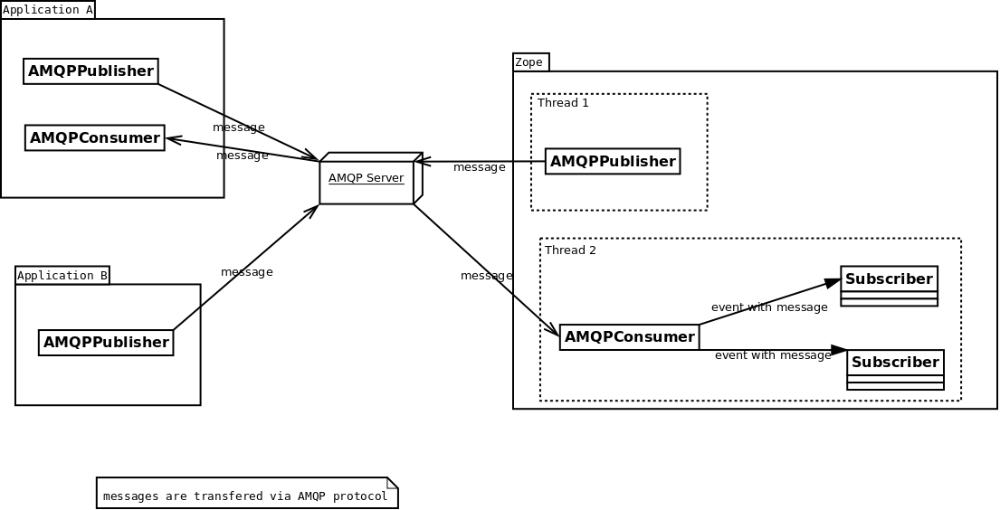

Introduction
============

This package is an almost complete rewrite of
`affinitic.zamqp <http://pypi.python.org/pypi/affinitic.zamqp>`_,
but preserves its ideas on configuring producers and consumers.

**collective.zamqp** acts as a *Zope Server* by co-opting Zope's asyncore
mainloop (with asyncore-supporting AMQP-library
`pika <http://pypi.python.org/pypi/pika>`_ [0.9.5]),
and injecting consumed messages as *request* for Zope's ZPublisher
(similarly to Zope ClockServer).

AMQP
----

The Advanced Message Queuing Protocol [#amqp]_ is a very performant protocol
that is implemented in many platforms, many languages and thus can exchange
information reliably between many framework/applications.  It enables good
Enterprise Application Integration (EAI) [#EAI]_ and real loosely coupled
systems communication.

The most known AMQP open source servers (aka Message Broker) are: `RabbitMQ
<http://www.rabbitmq.com>`_ and `Qpid <http://qpid.apache.org/>`_

Such message broker are scalable (using clustering) and performant enough to
handle several thousand of messages a second. Most of them handle hundred
thousands queues without any problem.

.. uml::

   client -> broker: request
   activate broker

   note left
       correlation_id
       reply_to
       ...
   end note

   broker -> service: request
   deactivate broker
   activate service

   note left
       correlation_id
       reply_to
       ...
   end note

   service --> broker: response
   deactivate service
   activate broker

   note right
       correlation_id=correlation_id
       routing_key=reply_to
       ...
   end note

   broker --> client: response
   deactivate broker

   note right
       correlation_id=correlation_id
       ...
   end note

Existing Python AMQP libraries
------------------------------

Python itself has different libraries available that implement the protocol. Here are the two most known libraries:

    * `amqplib <http://pypi.python.org/pypi/amqplib>`_
    * `txAMQP <http://pypi.python.org/pypi/txAMQP>`_

As you might not want to deal with a "low level" API, there is a higher level API available via
`kombu <http://pypi.python.org/pypi/kombu>`_.

Why this package ?
------------------

AFAIK Zope unfortunately doesn't have any AMQP integration.

The іdea behind this project is to provide a messaging solution together with the observer pattern
in Zope [#events]_. An image might help to understand what we try to implement here:

As you might also see, AMQP also permit asynchronous events in Zope.

What do we mean by Zope integration?
------------------------------------

  * Using ZCA to declare producer, consumer and connection to broker. In other word, create a clean Messaging Gateway [#MessagingGateway]_ to be use with zope applications.
  * Messaging with transaction support. Meaning a transactional delivery support together with Zope transaction [#transaction]_ (and ZODB)
  * Using ZCA to implement the Message Translator pattern [#MessageTranslator]_
  * Using ZCA to implement a Publish-Subscribe (aka Observer pattern) inside Zope with message coming from a Queue

Dependencies
------------

We use `pika <http://pypi.python.org/pypi/pika>`_ to send/receive messages and enable consumers in separate threads within Zope. We use as much as possible the API defined by `kombu <http://pypi.python.org/pypi/kombu>`_. So you might want also to read the `kombu documentation <http://github.com/ask/kombu>`_.

We use `grok <http://grok.zope.org>`_ to define our zope components
(as grok base classes).
This avoids us to write too much zcml.

.. rubric:: Footnotes

.. [#amqp] If needed here are some nice links that might help you to understand what AMQP is about:

    * http://blogs.digitar.com/jjww/2009/01/rabbits-and-warrens/
    * http://amqp.org

.. [#EAI] See:

    * http://en.wikipedia.org/wiki/Enterprise_application_integration
    * http://www.eaipatterns.com
    * A must read: Martin Fowler, *Patterns of Enterprise Application Architecture*, Addison-Wesley, 2003, ISBN: `0321127420 <http://www.amazon.com/exec/obidos/ASIN/0321127420/enterpriseint-20>`_
